# COURSE1-WEEK2
## BINARY CLASSIFICATION
Binary classification is the process of classification of somwthing as 1 or 0, for eg, if we want to recognize a image as cat img or a non cat image then it will be o for a non cat img and 1 for a cat img.
## NOTATION
We store the rgb values of the pixels of the image in matrix form .
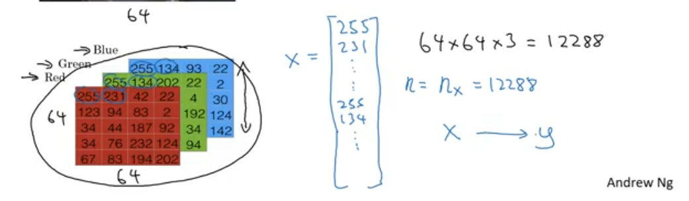
$x^{(n)}$ denotes the matrix of a particular image
Y denotes the the output of the image as 0 or 1 which is aldready given in the training set.
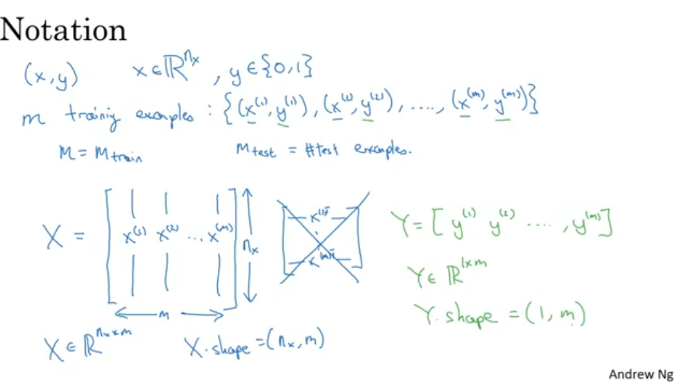
$x^{n}$1 ; $x^{n}$2 ; $x^{n}$3 these represent the feature of the images.
## LOGISTIC REGRESSION
Logistic regression is the algorithm for binary classification

$\hat{y}$ is the output of this algorithm and it is the probablity of the y having the output as 1

Ƶ is sent through sigmoid fucntion which gives $\hat{y}$ as output which compresses the whole thing between 0 and 1 
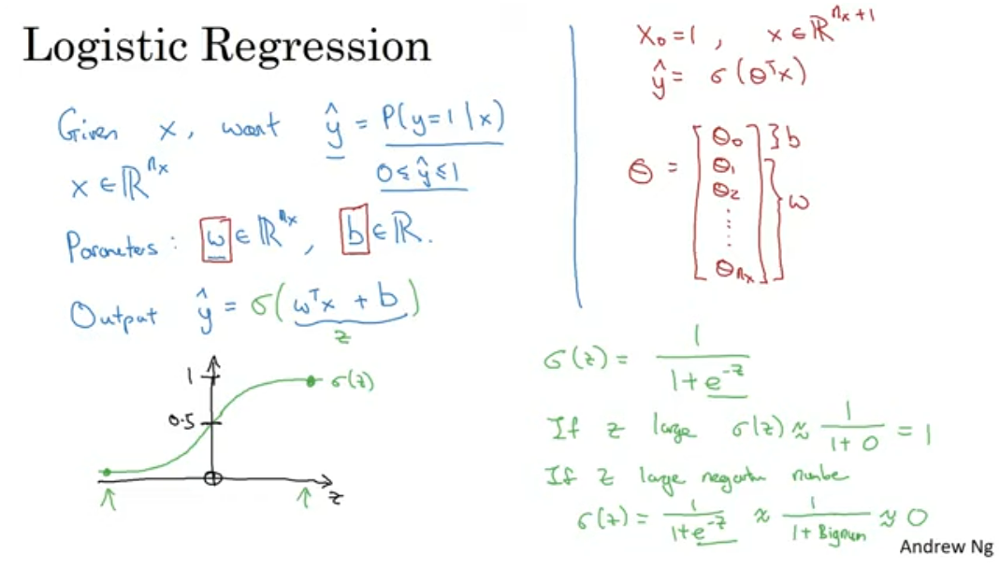
## COST FUNCTION 
Cost function is calcuated for the whole dataset but for one input loss fucntion is calculated .

Loss function is the measure of how good our output $\hat{y}$ is wrt to our given output y.

We do not use the square function because we may not find a global minima for gradient descendent.

Cost function is the sumation of all the loss function of all inputs and then we take their average.
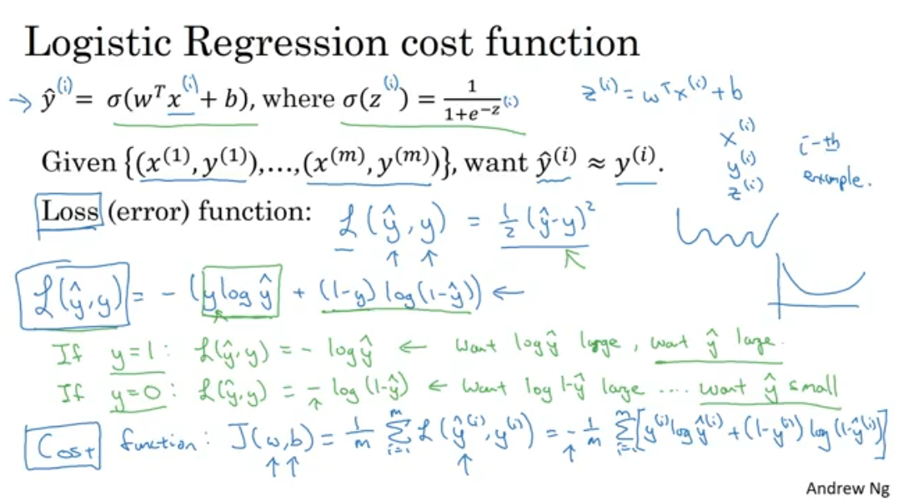
## GRADIENT DESCENT
It is a way to minimize the parameters like $w$ , $b$ ; on the curve we have to travel in such a way that we reach the global minima.
for that we calculate the deriatives.
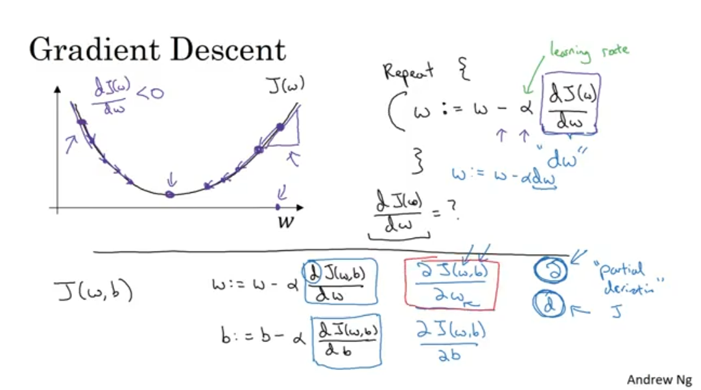
Mainly we need the dw derivative to calculate that we need to calculate all other derivative to find dw because of chain rule .
then there is formula to update the w with changes that.
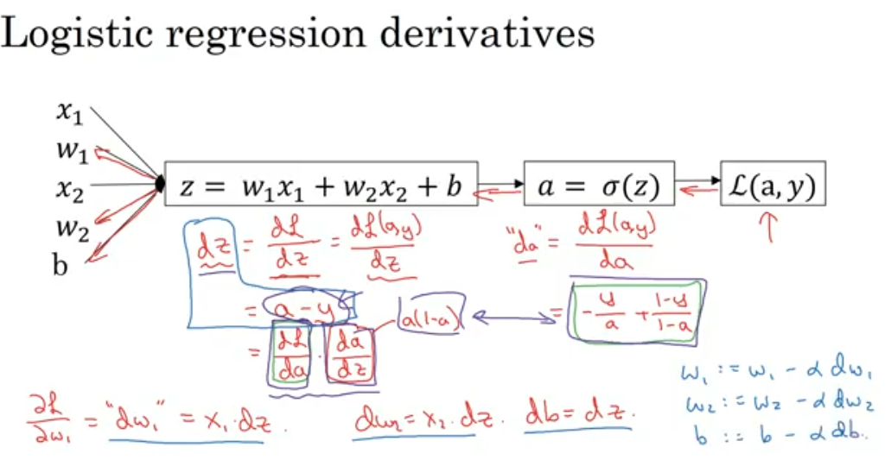
##  Computation Graph

Finding the output $ \hat{y} $ is the forward propagation step & finding the minimum cost function using gradient descent is the back propagation step.

The image below shows both forward and back propagation.

Calculating $ dv $ is first step(level) of back propagation and $ da $ & $ du $ are the second step(level) while $ db $ & $dc $ are third step(level) of back propagation.
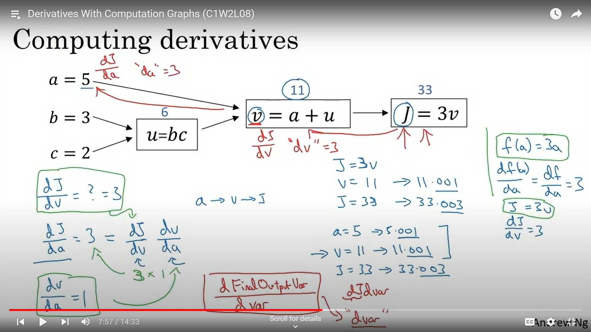

In the image below it shows how the derivatives are calculated which are needed to update the values of the parameters $ w1 $ , $ w2 $ & $ b $ until the values converge and eventually we find the minimum cost function $ J $.
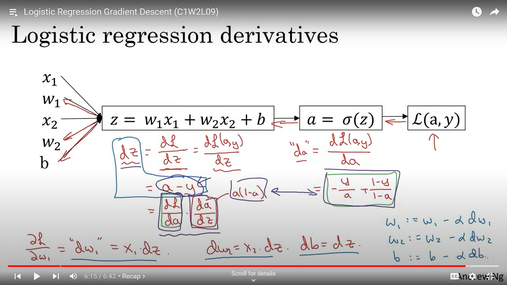

If we have a dataset with m inputs, then we find the mean of the derivatives and use that mean to update the values of the parameters.

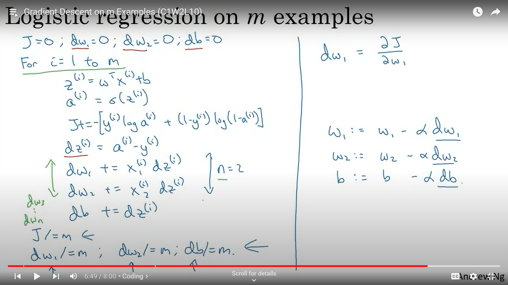

## Vectorization

Using for loops explicitly increases the computational time by a very large factor. So we need to reduce it and it can be done by vectorization.

In for loops if we have $ m $ input images then in will run one after the other for $ m $ times and then if we have $n$ features then it will again run for $n$ times in each of those $m$ iterations.

To avoid this we use vector(matrix) forms in which all the iterations basically takes place simultaneously, hence reducing the computational time.

The bias $b$ is a single real number so in python it broadcasts it according to the dimension of $Z$ which is (1,$m$).

But there still will remain one for loop for the iterations of gradient descent until we get the global optimum.

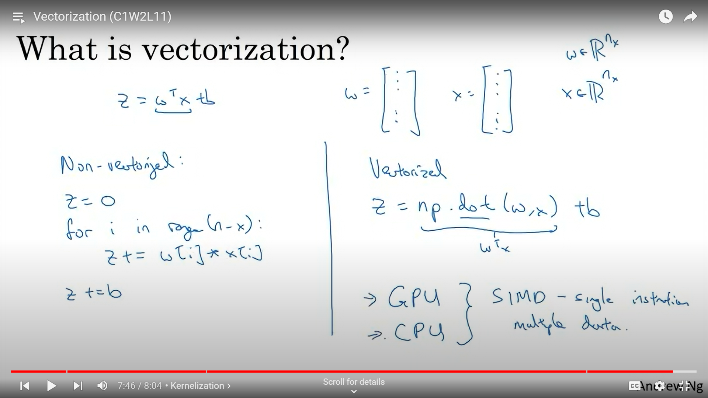

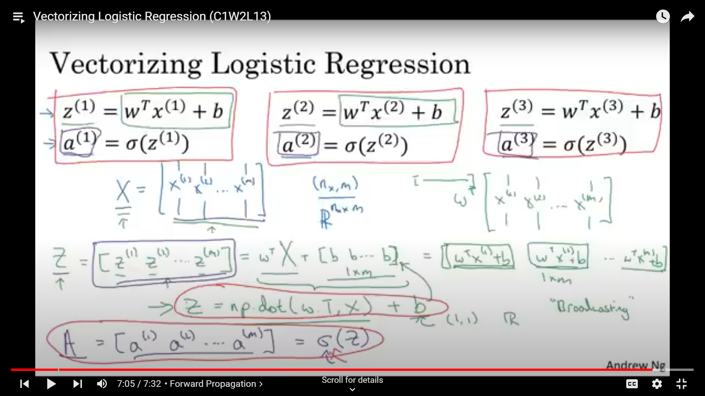

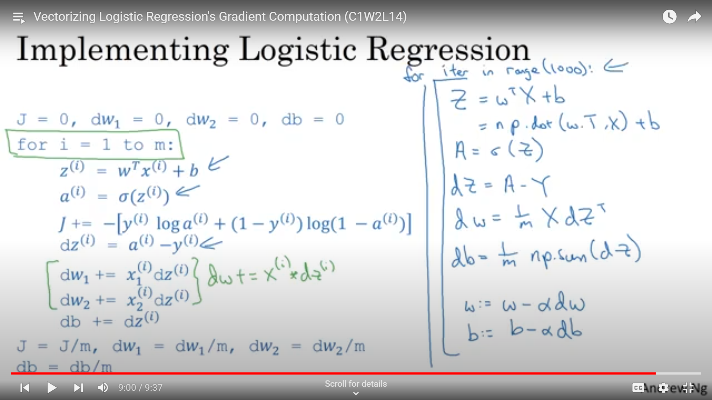
