# COURSE2-WEEK1
## Bias and varience
### train/dev/test
we can devide our data set in 3 parts train,test,dev where dev set is for checking different models and finding the best one.and then we can use that model on the test set and have unbaised opinion of how well it is working.
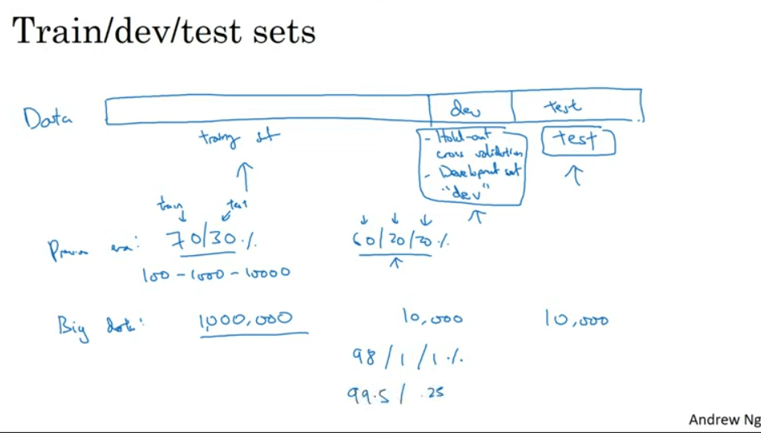
### bais and varience
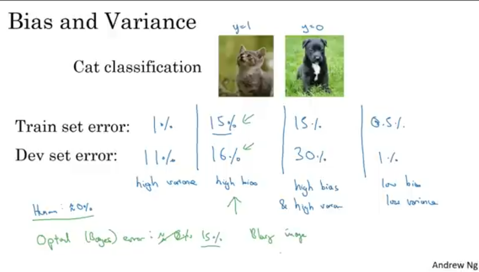
High Variance is when the test set error is way more than the train set error. It is because as variance increases, it leads to overfitting

In overfitting, model learns relevant as well as irrelevant features to such a high extent that it becomes highly analogous to training data input and fails to generalize output for newer data (validation set or dev set)

It is high bias when the model has high error in train set error itself . High bias leads to underfitting .

In underfitting , the model becomes way too genralized. Underfitting significantly undermines a model's predictive capabilities. Since the model fails to capture the underlying pattern in the data, it does not perform well, even on the training data. The resulting predictions can be seriously off the mark, leading to high bias.
## Basic solution
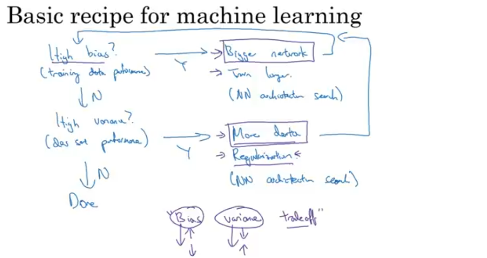
## Regularization
regularization is done to reduce overfitting of the model.
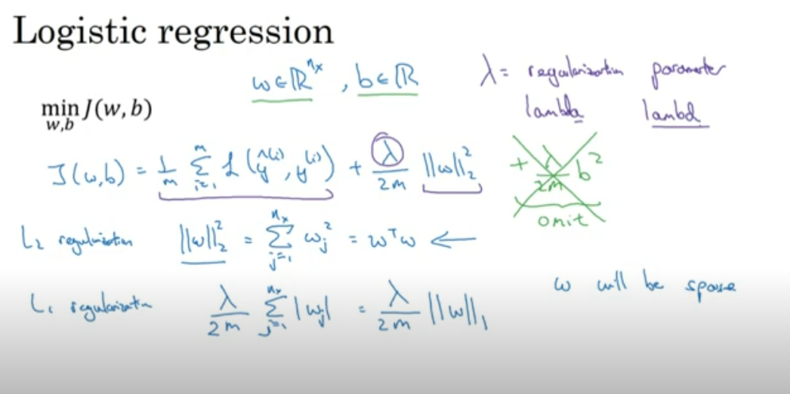
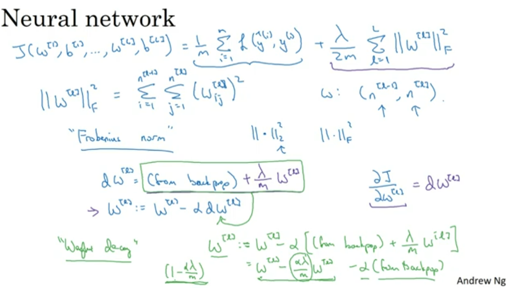
So basically when it comes $dw$ one more term is added and then when we use that $dw$ to change our $W^{[l]}$ then our $W^{[l]}$ is multiplies to something less than 1 and in case of overfitting $W^{[l]}$ decrease as lambd increses therefor our Ƶ also decreses and for if our activation function is tanh then it will lie within the linear function of tanh and as we know linear function are not able to compute complex function and descision but since our model is over fitted and should be shifted towards the linear side then this is a good option. This process leads to shrinkage of weights which reduces overfitting.
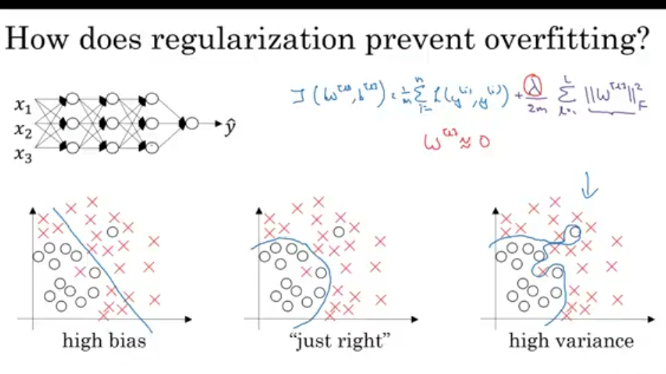
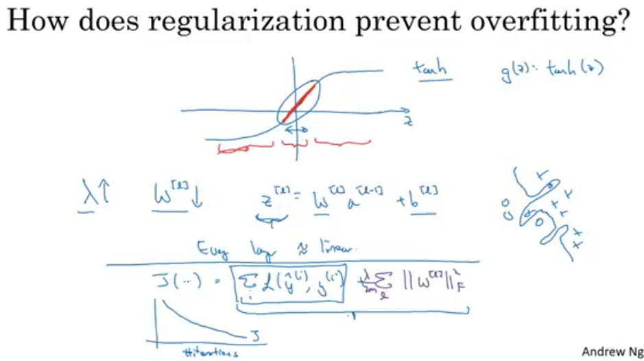
## Dropout Regularisation
In Dropout regularization we Dropout some nodes which is very random. For one iteration it is different for other iteration it is different , so we cannot depend on any specific node , so the weights are spread out which leads to shrinkage of weights hence reducing overfitting. We do this only when there is overfitting .
Algo of dropout regularization:
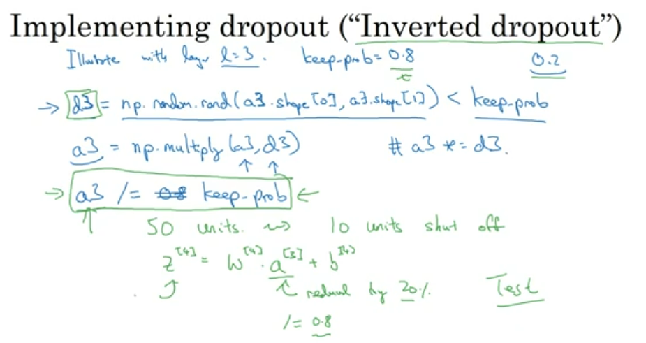
So we just make a random matrix of the dimension of the layer we want to dropout the nodes and we initialize the probablity of how many nodes must be deleted. And we keep a condition that random matrix generated is between 0 and 1 and if it is less then the probability than the $d3$ matrix is formed which is of 1 and 0 acc to the condition and then it is multiplied to $a3$ in which whichever nodes is multiplied to zero is deleted . We donot use drop out in test set as it will create random noise.

We can define different probablity for different layer according to the chance of overfitting acc to diff layers.

Disadvantage: The monotonically decresing graph of cost function is not obtained because of random deletion of the nodes.
## Other Ways Of Regularization
Training more data is one of the soln for regularization but more data can cost money there fore we can rotate image vertically or zoom out the images to create more data ,we can also add random distortion to the image( eg : images of numbers).

Early stopping as we can see in graph we stop at a point such that after that point the dev set error increases so we stop before that.
But the cost function is not reduced to its full extent but you dont have to try different values of lambd as in L2 regularization.
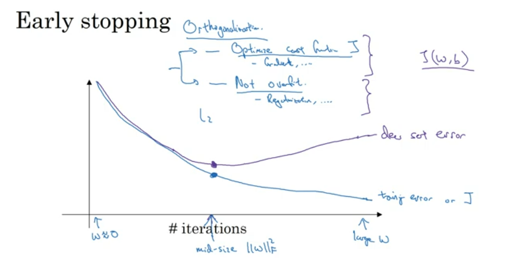
## Normalizing inputs
We normalize our input when the range of the features is drastically different.
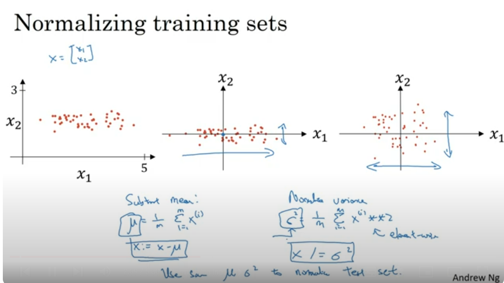
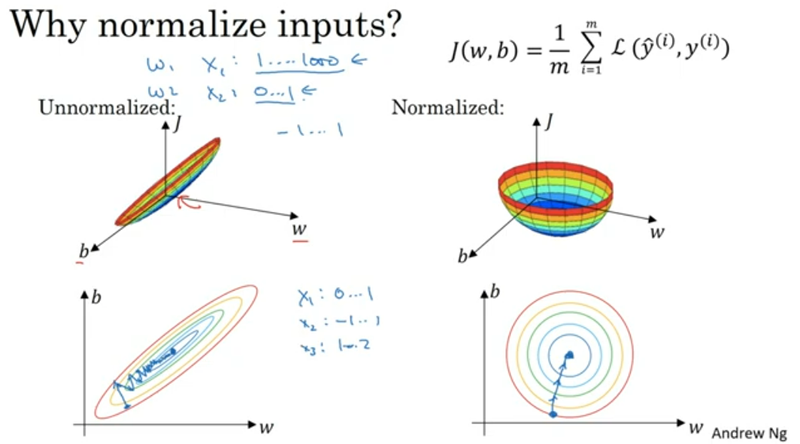
## Weight Intialization
We have this probelm of vanishing/exploding gradient such that if the weights are less than 1 then the activation values will decrease exponentially and if it more than 1 than it will explode
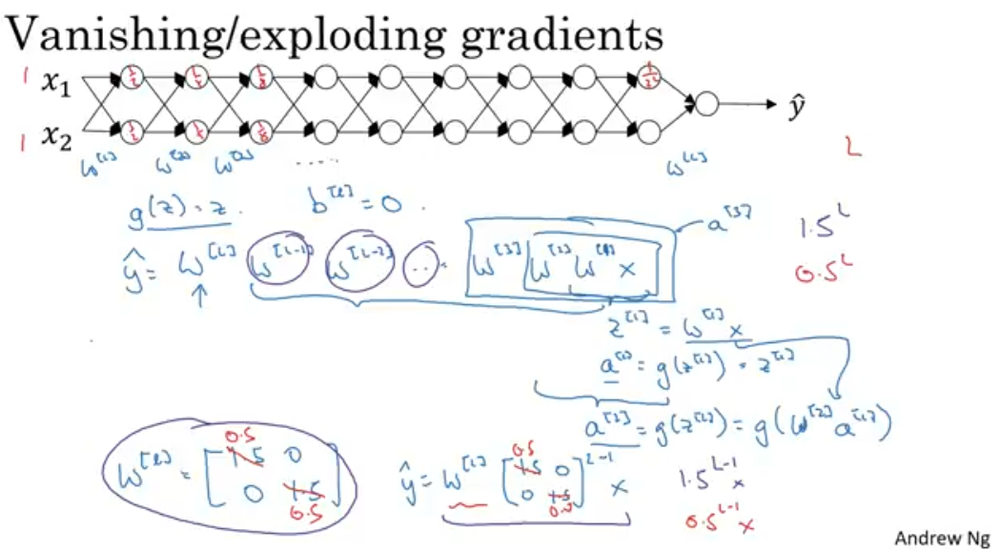
To solve this while initializing weights we multiply the sqr rt of the variance to the weights 
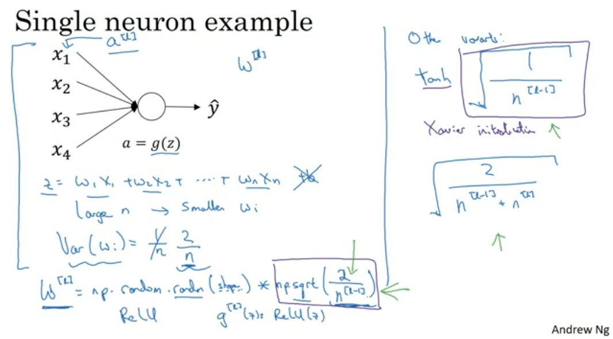
## Gradient checking
