# COURSE2-WEEK2
## MINI BATCH
If the dataset is very large like 5 million data then even using vectorization the model may become slow , so we divide the dataset into mini batches of dataset and rum the model seperatly on each mini batch
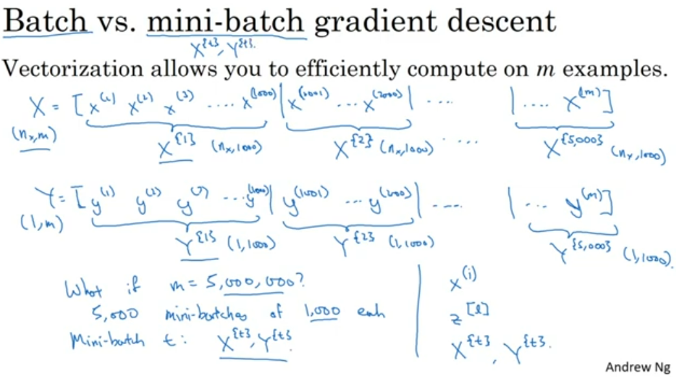
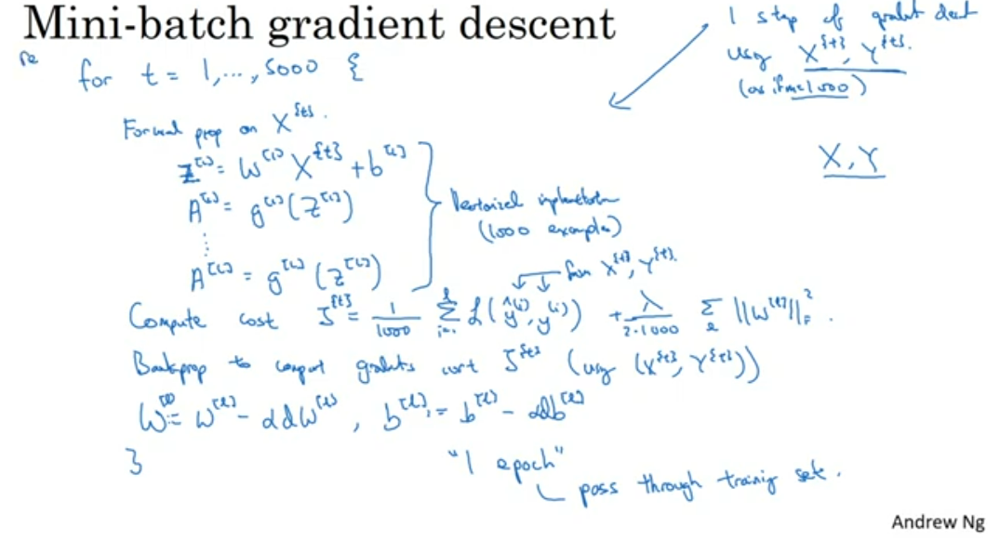
one epoch is one pass through a training set for one batch the one epoch generates one gradient descent and for 5000 mini batches it generates 5000 gradient descent.
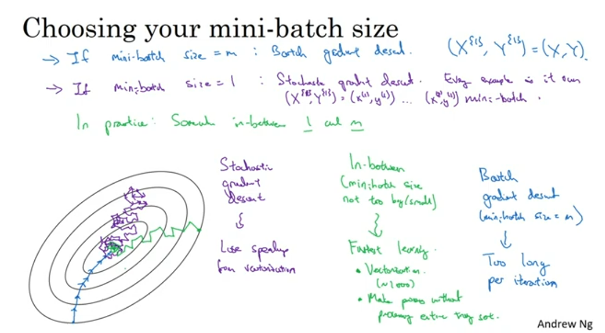
as we can see if we take the whole batch as one then the iteration will take long time.

if we take mini batch as 1 input then it will loose the speeding gained by vectorization .

So the best option is to mske mini batchs so that we have the advantage of the vectorization and the iterations are also fast
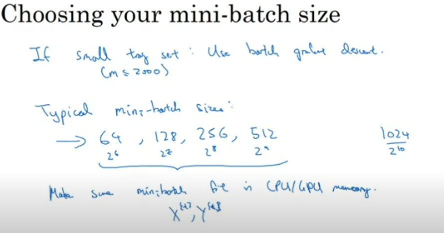
## EXPONENTIALLY WEIGHTED AVERAGE
An exponentially weighted average (EWA) is a type of moving average that gives more weight to recent data points while gradually reducing the weight of older points. It's useful in time series analysis for smoothing data and capturing trends.
Here $\beta$ is constant.
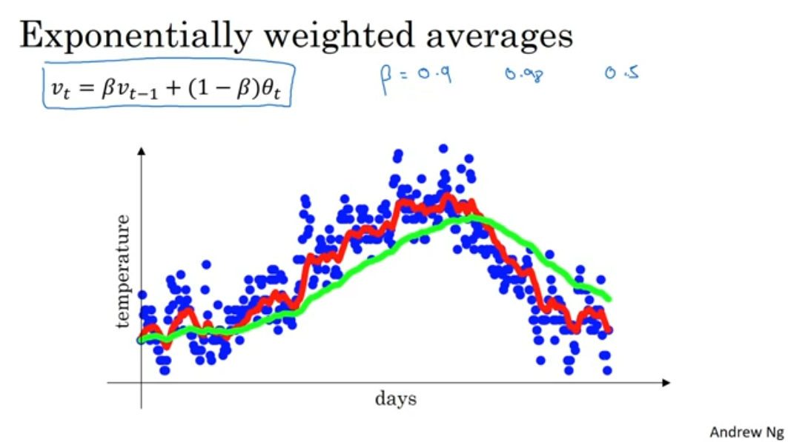
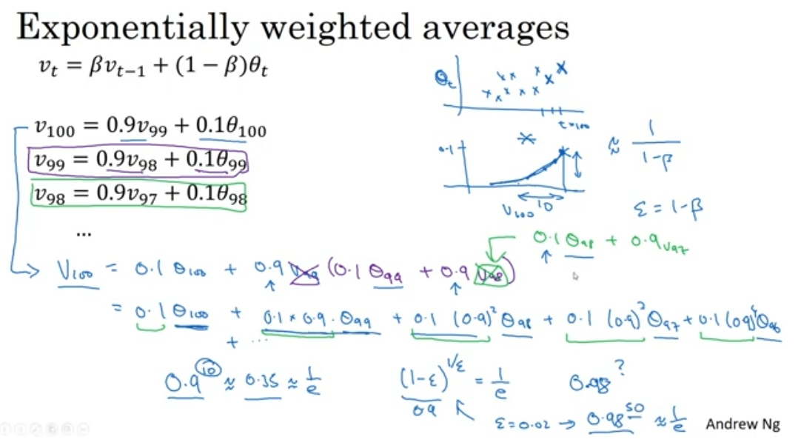
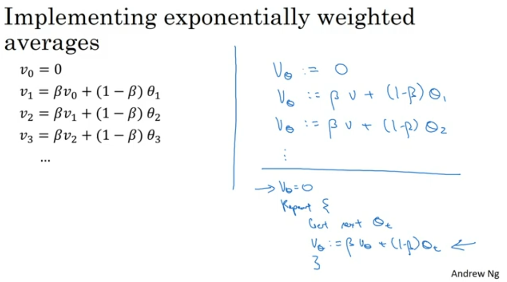
Bias correction is used in exponentially weighted averages to address the fact that, especially at the beginning of the time series, the average may be biased towards the initial values. This bias occurs because the exponentially weighted average starts with an initial value (0).
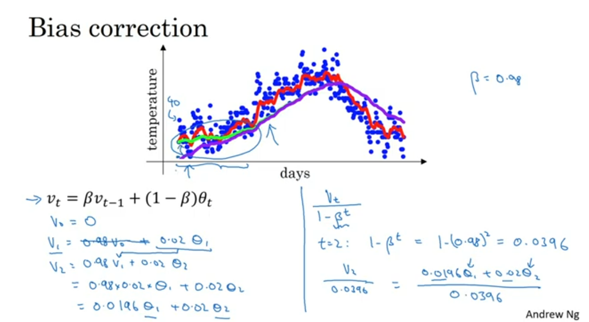
## Gradient Descent With Momentum
As we can see in the image the way of gradient descent reaaching the minima can be made faster by toning dwon the way like we see in EWS. This helps the learning to be fast. We clearly use EWS in it
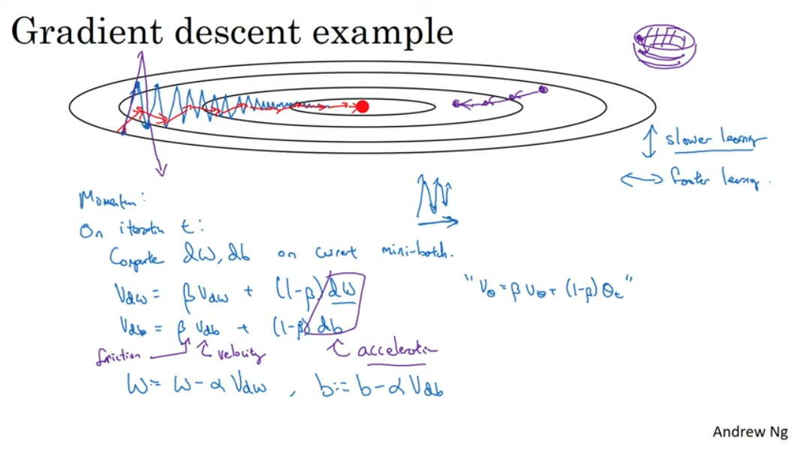
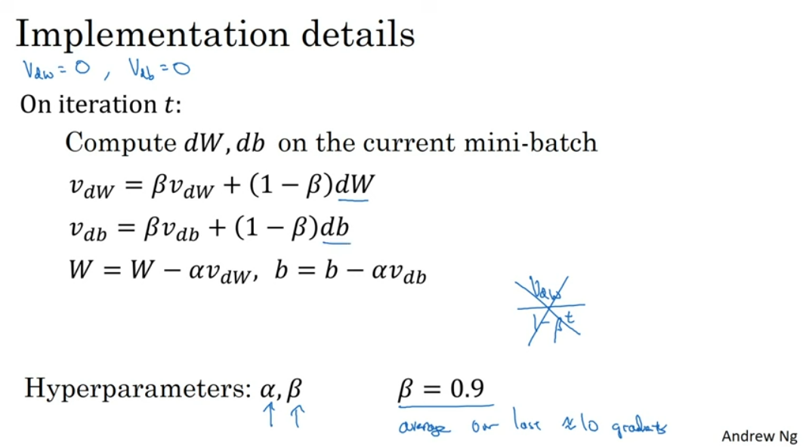
## RMSProp
It is one of the way to optimize our model.As we can see in the example that we want to reduce our travel in veritical direction and increse it in horizontal direction.
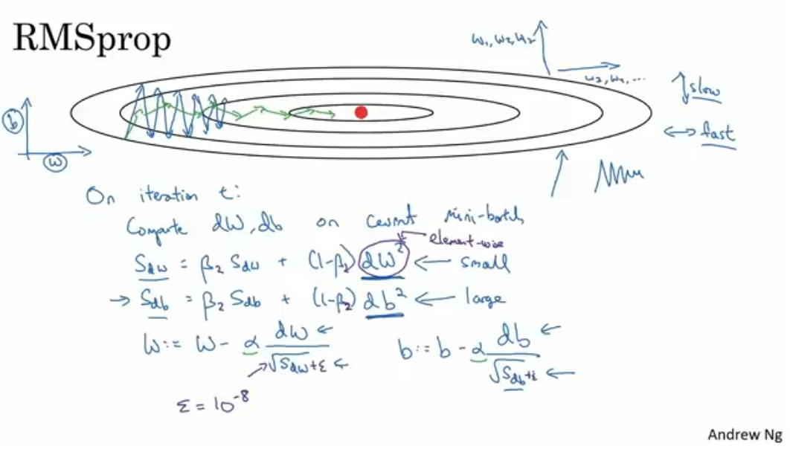
## Adam Optimization Algorithm
When we merge exponenetially weightes sum and RMSprop in one we get Adam optimization .It is seen to work impressively on many models
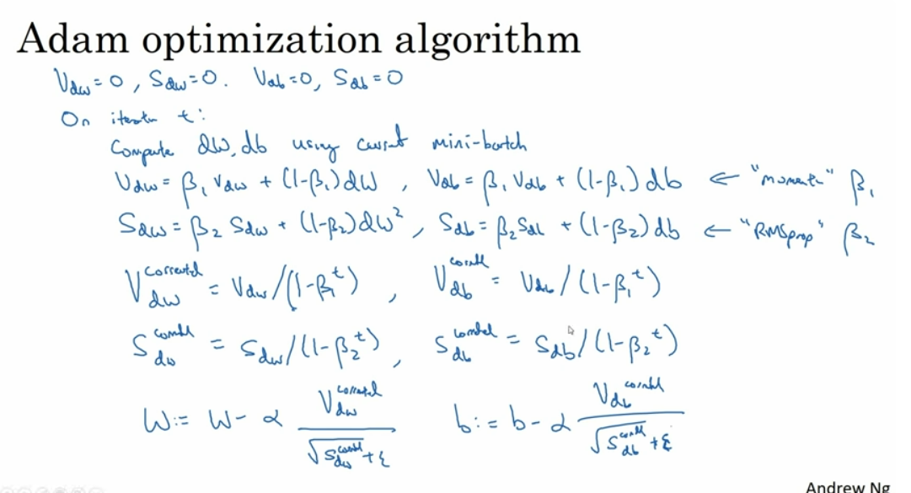
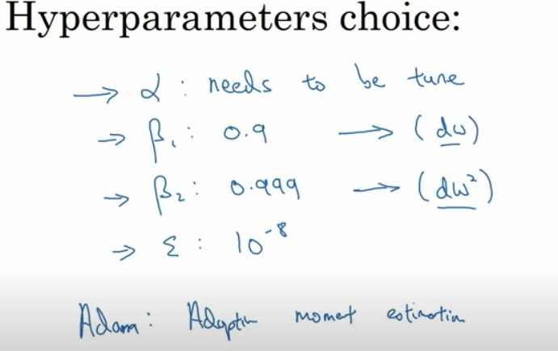
## Learning Rate Decay
When we have large learning rate , initially the learning and the movment towards minima is fast but as it reaches the minima it starts to lingar around and does not actually reaches it where else in less learning rate it does not lingar , so we can eventually decrease the learning rate.
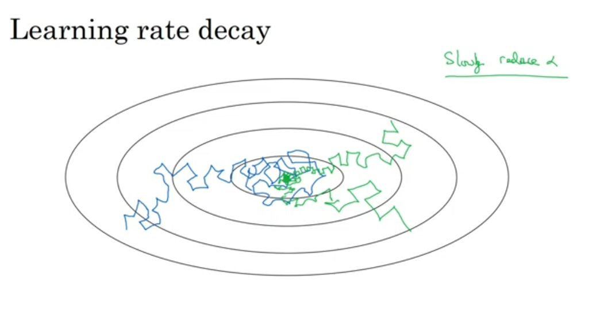
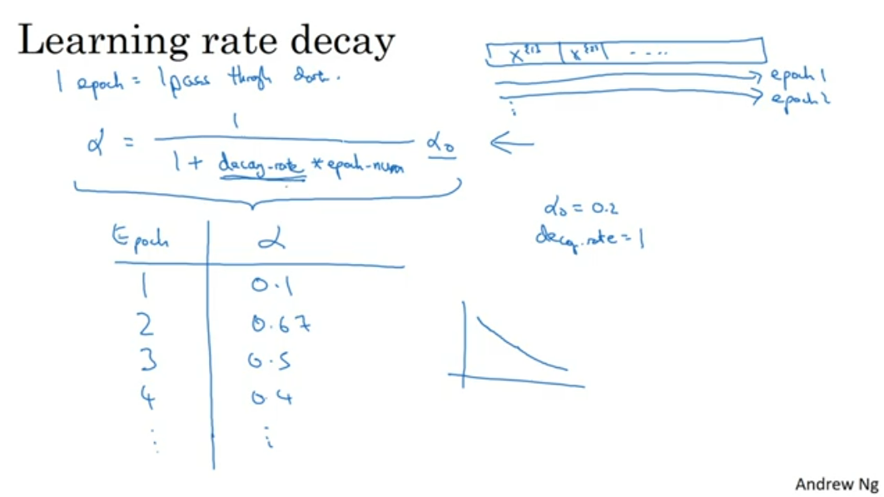
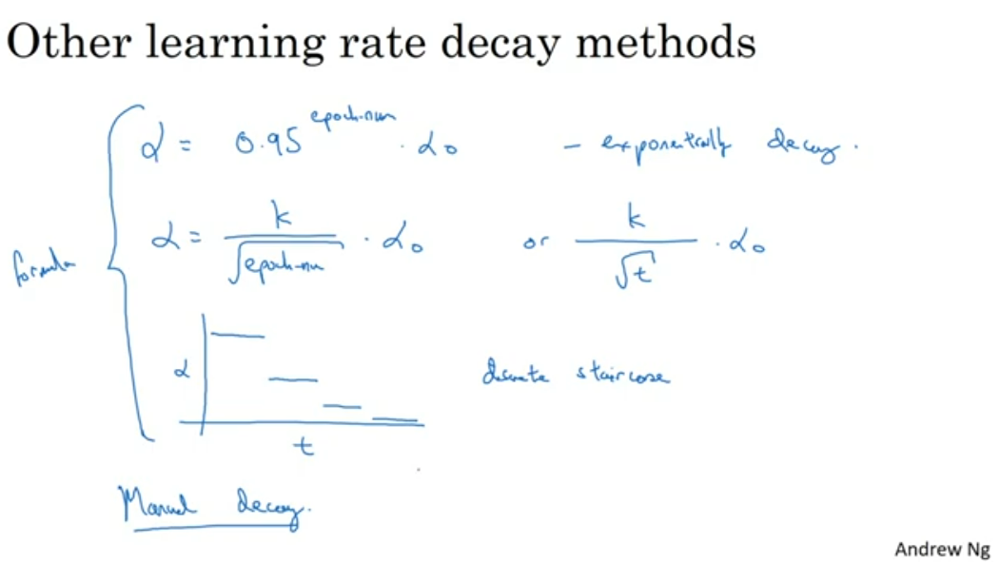