# COURSE4-WEEK1
## CNNS
Convolutional Neural Networks (CNNs) are a class of deep neural networks specifically designed for processing structured grid data, like images

Each filter slides (or convolves) across the input data, performing a dot product between the filter and local regions of the input data.

The filters are in such way / contain such numbers which can be used for eg. vertical edge detection.
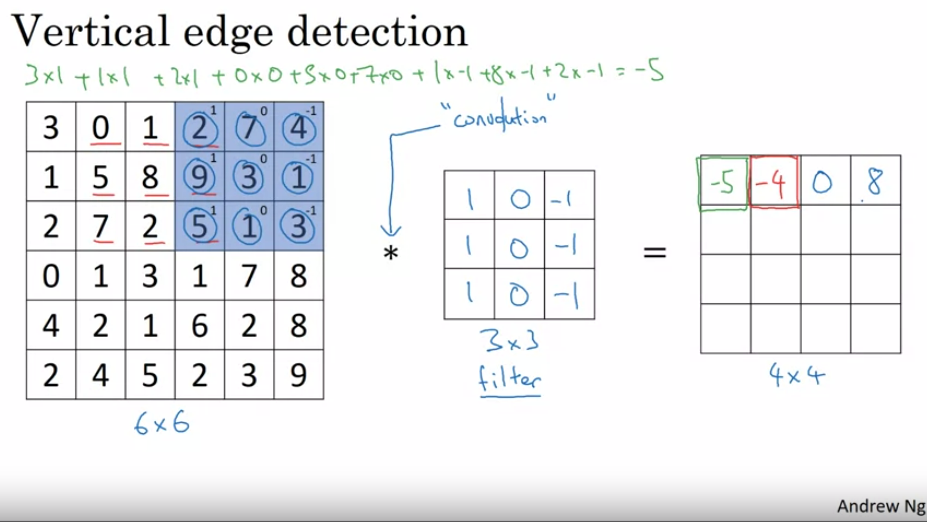
### PADDING
Padding is basically layer of zeros put around the whole matrix
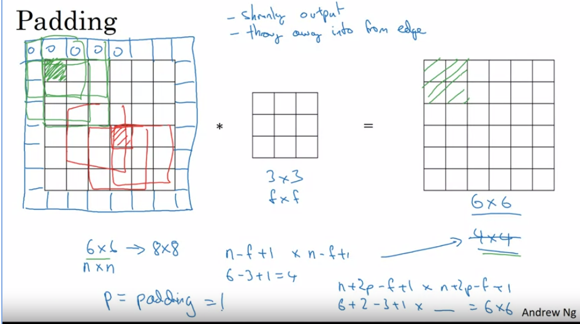
### STRIDED 
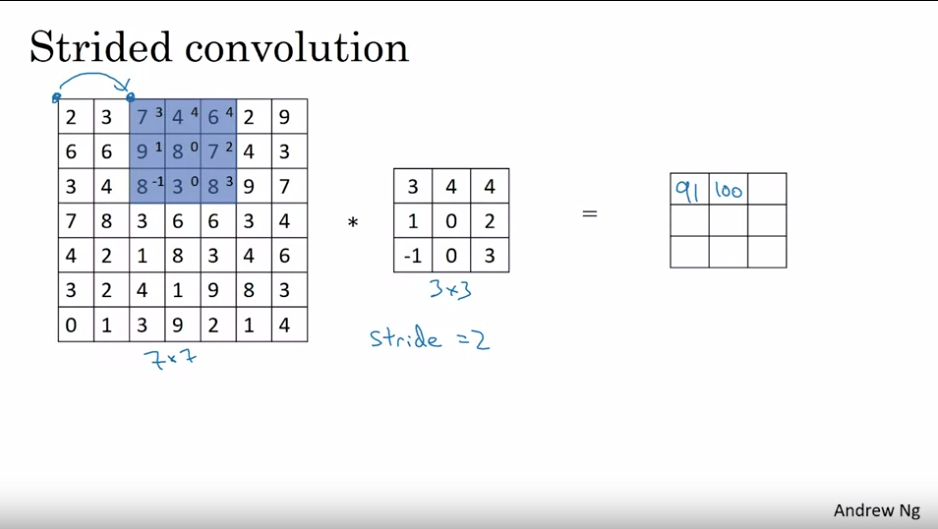
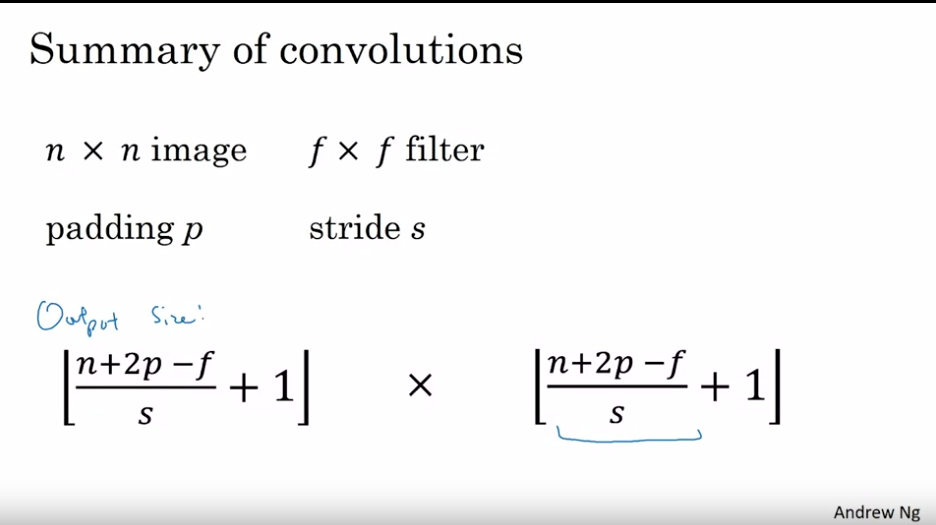
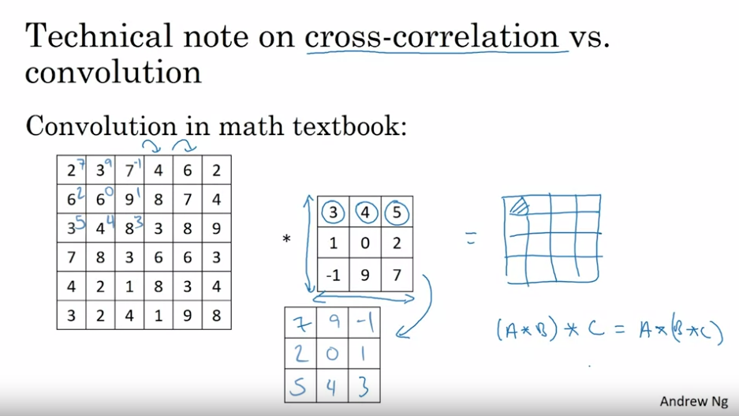
### CONVOLUTIONS OVER VOLUME
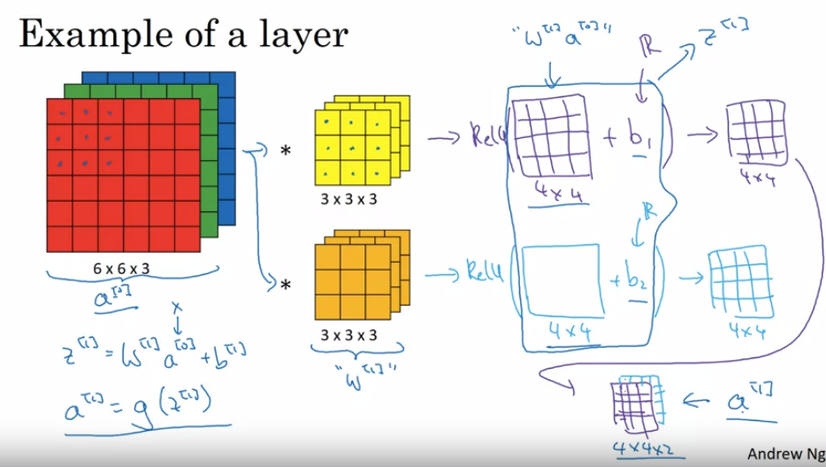
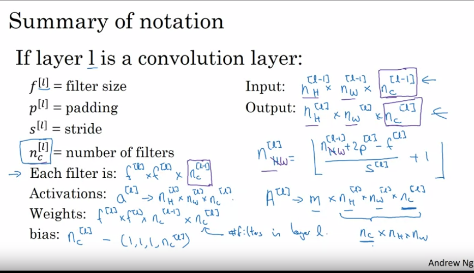
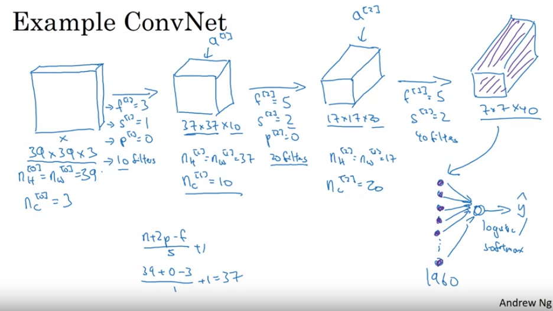
 Pooling layers are used to reduce the spatial dimensions (width and height) of the feature maps, which helps in reducing the number of parameters, preventing overfitting, and controlling computational cost.
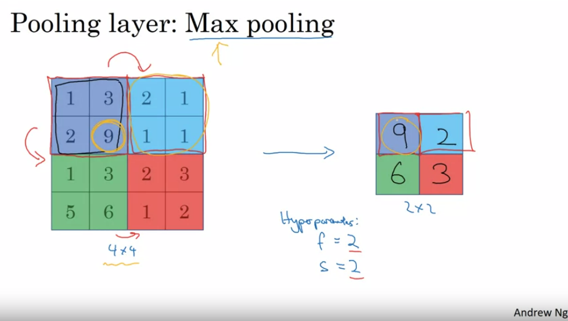
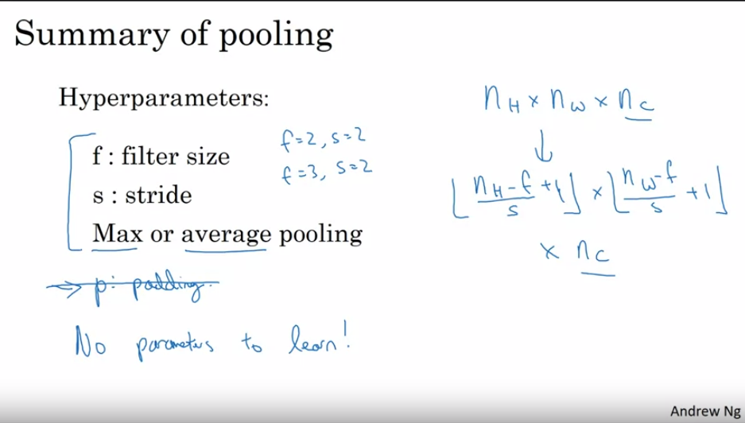
The convolutional neural network can be further converted to fully connected and then softmax.
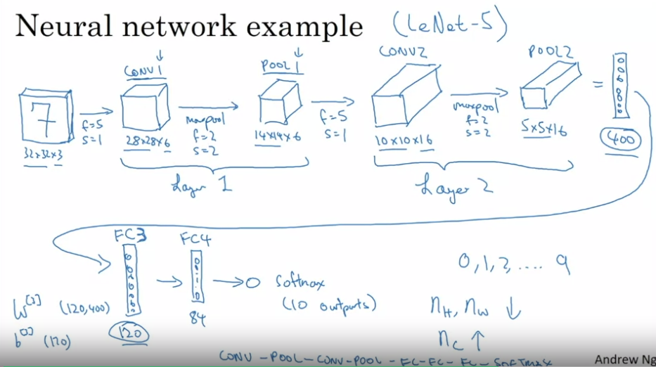
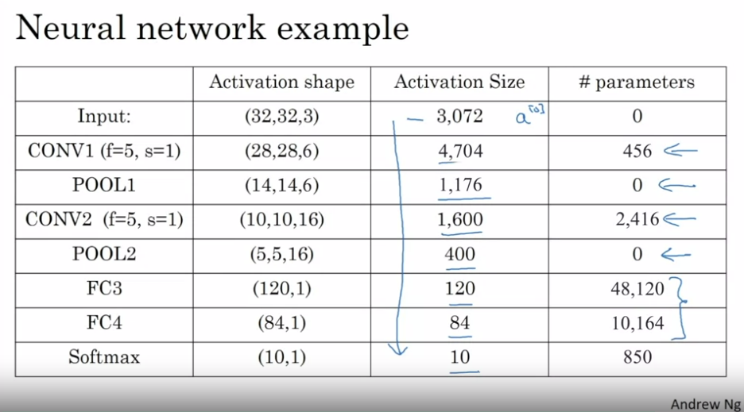
The reason for using convolutional netwrok when we have fully connected NNs is that it significantlly decreases the number of parameters we use like in FCN we for input layer have weights for every pixel of the image but here we have a filter which is treated as one weight and then we do dot product of the filter over the input matrix so the number of parameters is decreasing significantly and the computation cost is also decreasing .
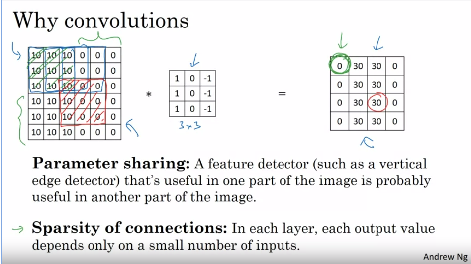
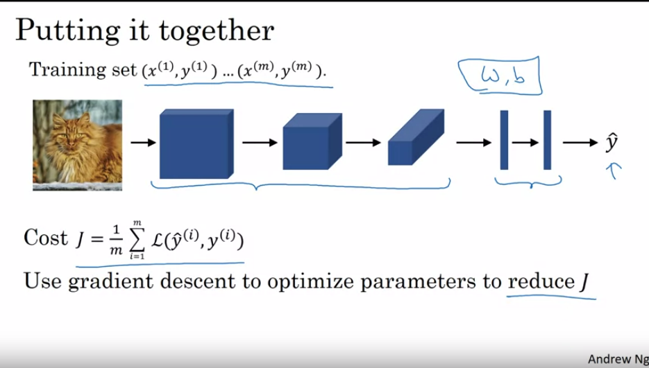