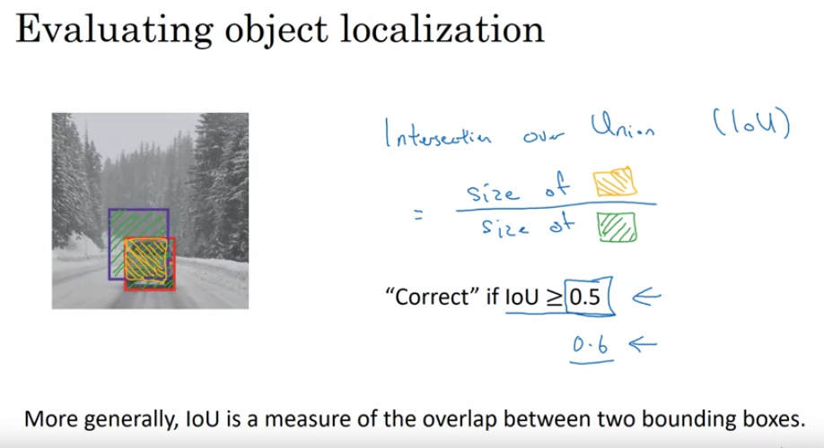

# COURSE4-WEEK3
## OBJECT LOCALIZATION

## LANDMARK DETECTION

## OBJECT DETETION
### SLIDING WINDOW 

### CONVOLUTIONAL IMPLEMENTATION OF SLIDING WINDOW

## BOUNDING BOX PREDICTIONS

## IOU

## NON-MAX SUPRESSION

## ANCHOR BOX 

## YOLO

## Semantic Segmentation with U-Net

## TRANSPOSE CONVOLUTIONS

## U-NET 

